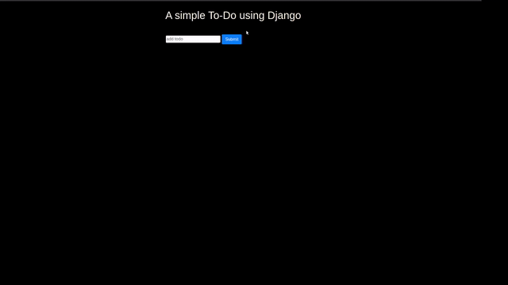

# Django ToDo app

## To-do app demo

## Steps To configure

* ## Setup venv
    Installation

        python3 install venv

    Setup a project folder

        mkdir foldername
        cd foldername

    Setup venv in that folder

        python3 -m venv env

    For Activating

        source env/bin/activate

* ## Install Django in the virtual environment

        sudo apt install django
        django-admin --version

* ## Start django Project

        django-admin start project <Project name>
        cd <Project name>

* ## Run server

        python3 manage.py runserver

* ## Start a app

        python3 namage.py startapp <appname>

